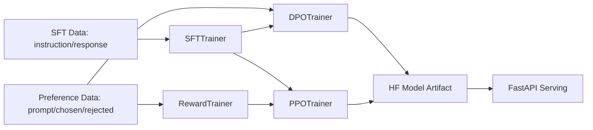

# RLHF-Native-Hugging-Face

A clean RLHF training repository built with native Hugging Face tools (no OpenRLHF, no Ray).

## Architecture



## Repository Layout

```text
rlhf-hf/
├── configs/
│   ├── sft.yaml
│   ├── rm.yaml
│   ├── dpo.yaml
│   ├── ppo.yaml
│   ├── accelerate.yaml
│   └── deepspeed_zero2.json
├── data/
│   ├── preprocess.py
│   ├── schema.md
│   └── examples/
├── src/
│   ├── sft/train_sft.py
│   ├── reward_model/train_rm.py
│   ├── rl/train_dpo.py
│   ├── rl/train_ppo.py
│   └── utils/{dataset.py,model.py,collators.py}
├── scripts/{run_sft.sh,run_rm.sh,run_rl.sh}
├── serving/fastapi_app.py
├── requirements.txt
└── README.md
```

## Data Schemas

- SFT: `{"instruction": "...", "response": "..."}`
- Preference: `{"prompt": "...", "chosen": "...", "rejected": "..."}`

See `data/schema.md`.

## Setup

```bash
pip install -r requirements.txt
```

## Training Steps

### 1) SFT

```bash
bash scripts/run_sft.sh configs/sft.yaml
```

### 2) Reward Model

```bash
bash scripts/run_rm.sh configs/rm.yaml
```

### 3A) DPO (preferred)

```bash
bash scripts/run_rl.sh dpo configs/dpo.yaml
```

### 3B) PPO (optional)

```bash
bash scripts/run_rl.sh ppo configs/ppo.yaml
```

## Serving

```bash
MODEL_PATH=outputs/dpo uvicorn serving.fastapi_app:app --host 0.0.0.0 --port 8000
```

Endpoints:
- `GET /health`
- `POST /generate` with `{ "prompt": "..." }`

## OpenRLHF → Native HF Mapping

- Actor model → `transformers.AutoModelForCausalLM`
- Reward model → `trl.RewardTrainer`
- PPO trainer → `trl.PPOTrainer`
- DPO option → `trl.DPOTrainer`
- Tokenizer → `transformers.AutoTokenizer`
- Ray distributed runtime → `accelerate` (+ optional DeepSpeed config)
- LoRA config → `peft.LoraConfig`

## MLOps Notes

- Training scripts are CLI-based and modular for schedulers like Airflow.
- MLflow logging is supported by setting `report_to: ["mlflow"]` in YAML configs.
- All model artifacts are saved in Hugging Face format.

## Differences vs OpenRLHF

1. Removes OpenRLHF-specific abstractions and Ray dependencies.
2. Uses Hugging Face Trainer/TRL trainers directly.
3. Keeps configuration and data schemas explicit and minimal.
4. Improves portability for 1–2 GPU setups with `accelerate`.
